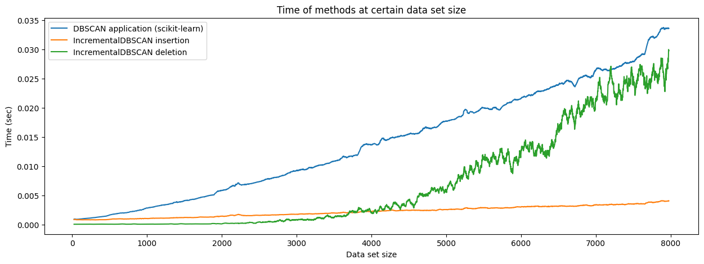

# IncrementalDBSCAN

`incdbscan` is an implementation of IncrementalDBSCAN, the incremental version of the DBSCAN clustering algorithm.

IncrementalDBSCAN lets the user update the clustering by inserting or deleting data points. The algorithm yields the same result as DBSCAN but without reapplying DBSCAN to the modified data set.

Thus, IncrementalDBSCAN is ideal to use when the size of the data set to cluster is so large that applying DBSCAN to the whole data set would be costly but for the purpose of the application it is enough to update an already existing clustering by inserting or deleting some data points.

The implementation is based on the following paper. To see what's new compared to the paper, jump to [Notes on the IncrementalDBSCAN paper](https://github.com/DataOmbudsman/incdbscan/blob/master/notes/notes-on-paper.md).

> Ester, Martin; Kriegel, Hans-Peter; Sander, Jörg; Wimmer, Michael; Xu, Xiaowei (1998). *Incremental Clustering for Mining in a Data Warehousing Environment.* In: Proceedings of the 24rd International Conference on Very Large Data Bases (VLDB 1998).

<p align="center">
  
</p>

## Table of Contents

- [Highlights](#Highlights)
- [Installation](#installation)
- [Usage](#usage)
- [Performance](#Performance)

## Highlights

The `incdbscan` package is an implementation of the IncrementalDBSCAN algorithm by Ester et al., with about 40 unit tests covering diverse cases, and with [additional corrections](https://github.com/DataOmbudsman/incdbscan/blob/master/notes/notes-on-paper.md) to the original paper.

## Installation

`incdbscan` is on PyPI, and can be installed with `pip`:
```
pip install incdbscan
```

The latest version of the package requires at least Python 3.9.

## Usage

The algorithm is implemented in the `IncrementalDBSCAN` class.

There are 3 methods to use:
- `insert` for inserting data points into the clustering
- `delete` for deleting data points from the clustering
- `get_cluster_labels` for obtaining cluster labels

All methods take a batch of data points in the form of an array of shape `(n_samples, n_features)` (similar to the `scikit-learn` API).

```python
from sklearn.datasets import load_iris
X = load_iris()['data']
X_1, X_2 = X[:100], X[100:]

from incdbscan import IncrementalDBSCAN
clusterer = IncrementalDBSCAN(eps=0.5, min_pts=5)

# Insert 1st batch of data points and get their labels
clusterer.insert(X_1)
labels_part1 = clusterer.get_cluster_labels(X_1)

# Insert 2nd batch and get labels of all points in a one-liner
labels_all = clusterer.insert(X_2).get_cluster_labels(X)

# Delete 1st batch and get labels for 2nd batch
clusterer.delete(X_1)
labels_part2 = clusterer.get_cluster_labels(X_2)
```

For a longer description of usage check out the [notebook](https://github.com/DataOmbudsman/incdbscan/blob/master/notebooks/incdbscan-usage.ipynb) developed just for that!

## Performance

Performance has two components: insertion and deletion cost.

<p align="left">
  
</p>

The cost of **inserting** a new data point into IncrementalDBSCAN is quite small and **grows slower** than the cost of applying (`scikit-learns`'s) DBSCAN to a whole data set.  In other words, *given that* we have a data set _D_ clustered with IncrementalDBSCAN, and we want to see which cluster would a new object _P_ belong to, it is faster to insert _P_ into the current IncrementalDBSCAN clustering than to apply DBSCAN to the union of _D_ and _P_.

The cost of **deleting** a data point from IncrementalDBSCAN **grows faster** than the cost of applying (`scikit-learns`'s) DBSCAN to the data set minus that data point. Thus, the cost of deletion in IncrementalDBSCAN is quite small below a certain data set size, but becomes larger as data set size grows.

These results do not imply that it is very efficient to cluster a whole data set with a series of IncrementalDBSCAN insertions. If we measure the time to cluster a data set with DBSCAN versus to cluster the data by adding the data points one by one to IncrementalDBSCAN, IncrementalDBSCAN will be slower compared to DBSCAN. A typical performance number is that clustering 8,000 data points takes about 10-20 seconds with this implementation.

See [this notebook](https://github.com/DataOmbudsman/incdbscan/blob/master/notebooks/performance.ipynb) about performance for more details.

### Known limitations

- **Batch insertion**: In the current implementation batch insertion of data points is not efficient, since pairwise distance calculation between new and existing data points is not yet vectorized. 
- **Deletion**: Data point deletion can take long in big data sets (big clusters) because of a graph traversal step. There isn't any clear direction of making it more efficient algorithmically. 
